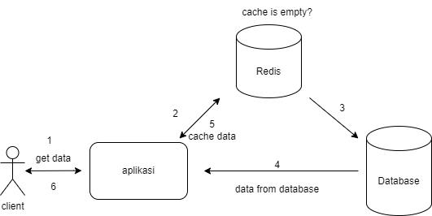
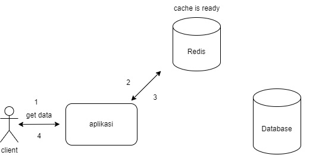

# What Is Redis?

Redis (Remote Dictionary Server) is a memory-based key-value database system used as a database, cache, and message broker. Redis itself is one of the NoSQL databases that is very popular because of its speed as a database system for storage. As explained, redis stores the main data in memory (RAM).

Because of this speed, redis is usually used for cache systems in applications. Redis is also used to support RDBMS performance for storing certain key data.

# What Is Caching?

Caching is the process of storing frequently used data into memory so that it can be accessed more quickly. This is very useful because memory access is faster than access to main storage such as databases. Because storing data in memory the system can access it faster. Caching can also reduce the server connection load.

# How Redis Works?

<div align="center" style="background-color: white; padding: 20px;">
  
</div>

When the application receives a data request, it will first check if the data is already available in the Redis cache.
</br>
If it is not found in the cache, the application will retrieve the data from the database.
</br>
After getting the data, the application will provide a response and store the results into the Redis cache as keys and values.

<div align="center" style="background-color: white; padding: 20px;">
  
</div>
On subsequent data requests, the application will look for the response data in the Redis cache without the need to query the database again.

# Benefits of Redis?

- Faster and more efficient process → With the cache, data response will be faster.
- Can reduce costs → Caching can reduce application workload, because it does not always query directly to the database to get data.
- Good scalability → With its speed, redis can meet the needs of high requests.

# Installing Redis

You can install Redis on Linux, Windows, and macOS. You can also use Docker to run Redis.
But in this tutorial, we will use Docker to run Redis.

```bash
make build
```

# Basic Operations in Redis

1. Set data

```go
err := client.Set(ctx, "key", "value", 0).Err()
if err != nil {
	fmt.Println("Error setting key:", err)
	return
}
```

2. Get data

```go
val, err := client.Get(ctx, "key").Result()
if err != nil {
	fmt.Println("Error getting key:", err)
	return
}

fmt.Println("Key value:", val)
```

3. Delete data

```go
err := client.Del(ctx, "key").Err()
if err != nil {
	fmt.Println("Error deleting key:", err)
	return
}
```

# Usage

1. Run the application in local

```bash
make run
```

2. You can try the endpoints using Postman or curl

```bash
curl http://localhost:8080/
```

3. Run the with test

```bash
make test
```

If you want see data in redis, you can use open gui redis in browser

```bash
user: root
password: root

http://localhost:8081/
```

After that, you can see data in redis
